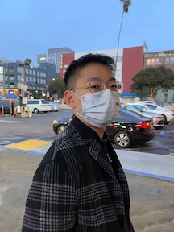

## Jingji Chen's Personal Website

### About Me

I am a Ph.D. student in Computer Science at Purdue University under the supervision of Prof. Xuehai Qian. Before that, I was a Ph.D. student in Computer Engineering at the University of Southern California, also under the supervision of Prof. Xuehai Qian. I obtained my Bachelor of Engineering degree in the Department of Computer Science and Technology at Tsinghua University. My research interests majorly focus on system and architectural level specializations for challenging workloads like graph processing and machine learning. You can find my CV [here](https://github.com/AmadeusChan/AmadeusChan.github.io/blob/main/docs/resume.pdf).

### News 

* **Aug. 2022**  Tranferred from USC to Purdue University as a Ph.D. student in Computer Science.
* **Aug. 2022**  One paper gets accepted by **ASPLOS'2023** (the 28th International Conference on Architectural Support for Programming Languages and Operating Systems).
* **Nov. 2021**  One paper gets accepted by **ASPLOS'2022** (the 27th International Conference on Architectural Support for Programming Languages and Operating Systems).
* **July 2021**  One paper gets accepted by **TOCS** (ACM Transactions on Computer Systems).
* **Feb. 2020**  One paper gets accepted by **PLDI'2020** (the 41st ACM SIGPLAN Conference on Programming Language Design and Implementation).
* **Aug. 2019**  Awarded the Annenberg Fellowship at USC Viterbi School of Engineering. 
* **Aug. 2019**  Enter USC Viterbi School of Engineering as a Ph.D. student (in Computer Engineering). 
* **July 2019**  Graduated from Tsinghua University (Department of Computer Science and Technology)!

### Experience

* **May 2022-Aug. 2022** Research intern at Microsoft Research, Redmond (the RiSE lab, supervisor: Saeed Maleki).
* **July 2018-Sept. 2018** Summer research intern at USC (supervisor: Xuehai Qian).

### Publications or Accepted Papers

* _**Jingji Chen**_, Xuehai Qian, DecoMine: A Compilation-based Graph Pattern Mining System with Pattern Decomposition. The 28nd Conference on Architectural Support for Programming Languages and Operating Systems (ASPLOS’2023).
* Gengyu Rao, _**Jingji Chen**_, Jason Yik, Xuehai Qian, SparseCore: Stream ISA and Processor Specialization for Sparse Computation. The 27nd Conference on Architectural Support for Programming Languages and Operating Systems (ASPLOS’2022).
* Youwei Zhuo*, ___Jingji Chen* (* equal contribution)___, Gengyu Rao, Qinyi Luo, Yanzhi Wang, Hailong Yang, Depei Qian, Xuehai Qian, Distributed Graph Processing System and Processing-In-Memory Architecture with Precise Loop-Carried Dependency Guarantee. ACM Transactions on Computer Systems (TOCS), Volume 37, Issue 1-4, Artical No. 5, 2021.
* Youwei Zhuo*, ___Jingji Chen* (* equal contribution)___, Qinyi Luo, Yanzhi Wang, Hailong Yang, Depei Qian, Xuehai Qian, SympleGraph: Distributed Graph Processing with Precise Loop-carried Dependency Guarantee. The 41st ACM SIGPLAN Conference on Programming Language Design and Implementation (PLDI’2020).

### Award

* **Aug. 2019** Annenberg Fellowship, University of Southern California.
* **Oct. 2018** Award for Academic Excellence, Tsinghua University.
* **Oct. 2018** Hengda Scholarship.
* **Apr. 2018** Outstanding Winner(Highest award, 16/10000), ICM Contest, COMAP.
* **Aug. 2014** Silver Medalist, National Olympiad in Informatics (NOI), China.

### Education

* **Aug. 2022-Present** Ph.D. in Computer Science, Department of Computer Science, Purdue University.
* **Aug. 2019-Aug. 2022** Ph.D. in Computer Engineering, Ming Hsieh Department of Electrical and Computer Engineering, University of Southern California.
* **Aug. 2015-July 2019** Bachelor of Engineering, Department of Computer Science and Technology, Tsinghua University.

